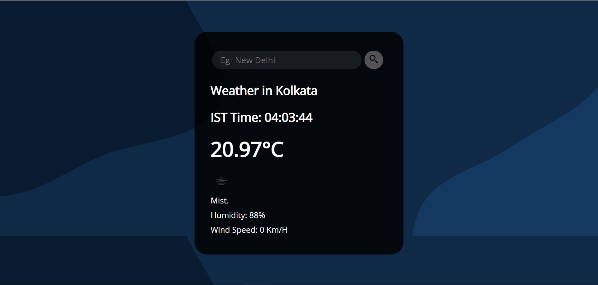

# Weather-News

Weather-News tells you Weather of any location fetching through [Open Weather API](https://openweathermap.org/api). It also provides you with local time in your location using JavaScript.

## Tech-Stack

- HTML
- CSS
- JavaScript

Fork this repo and clone it in your repository to use it.

I would be adding UV index and Air Pollution data soon too.

